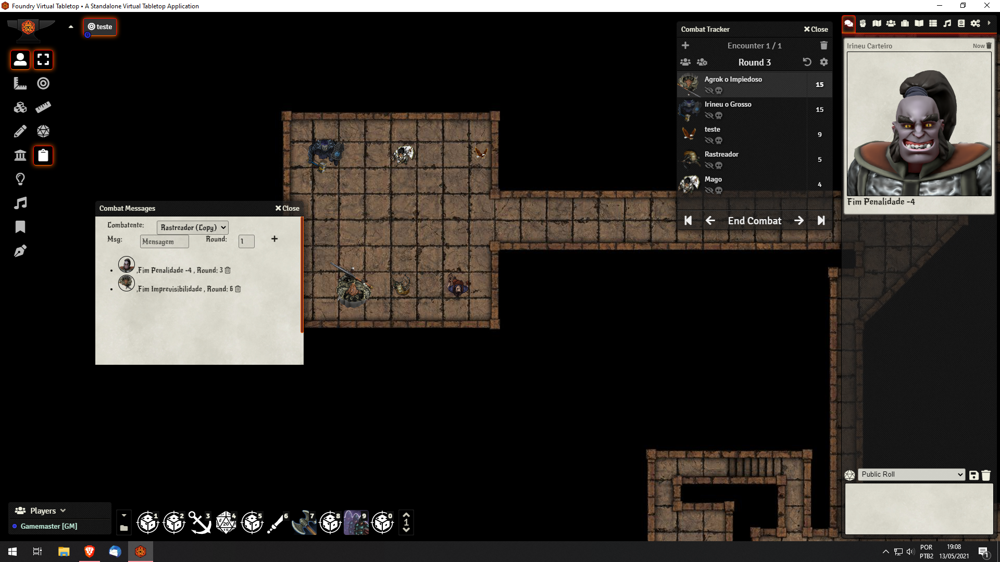

# Combat Messages

## Módulo para Foundry Vtt
Defina lembretes que serão apresentados no chat no Round desejado.
#### Instalação
Copia o link (https://raw.githubusercontent.com/marcoswalker/combat-messages/master/module.json) e colar na caixa manifest ao instalar módulo no Foundry Vtt. Depois é só ativar o módulo dentro do mundo.